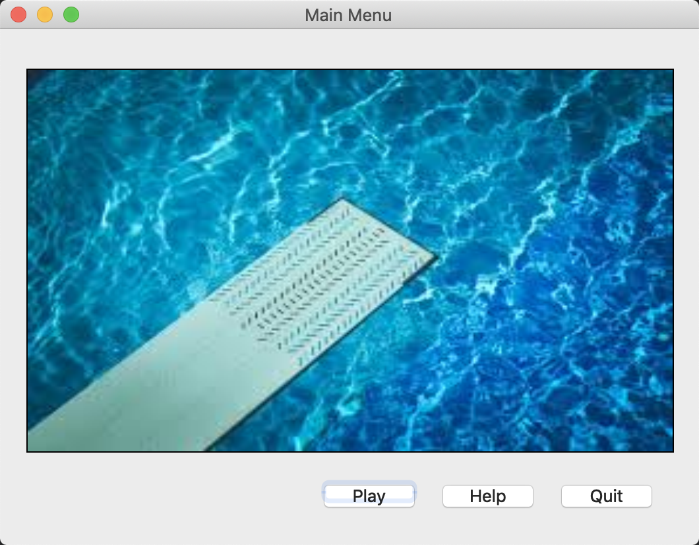
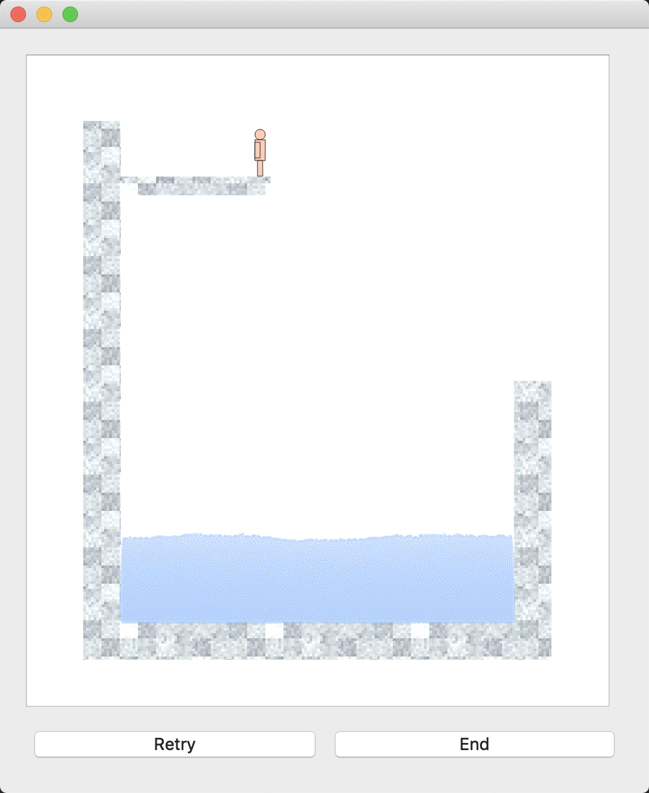
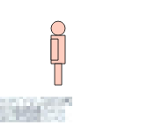
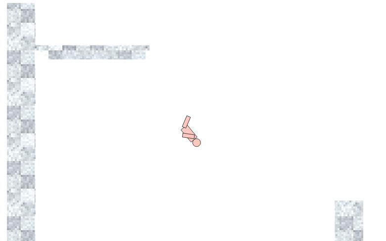
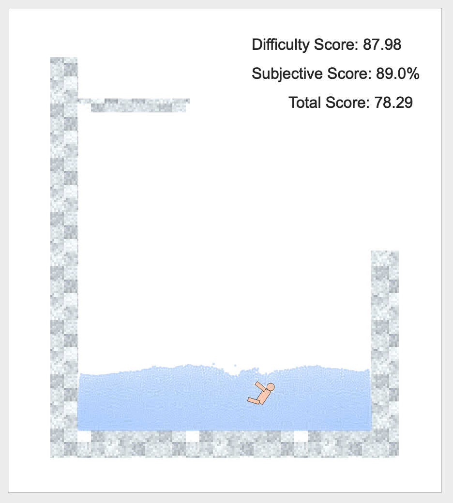
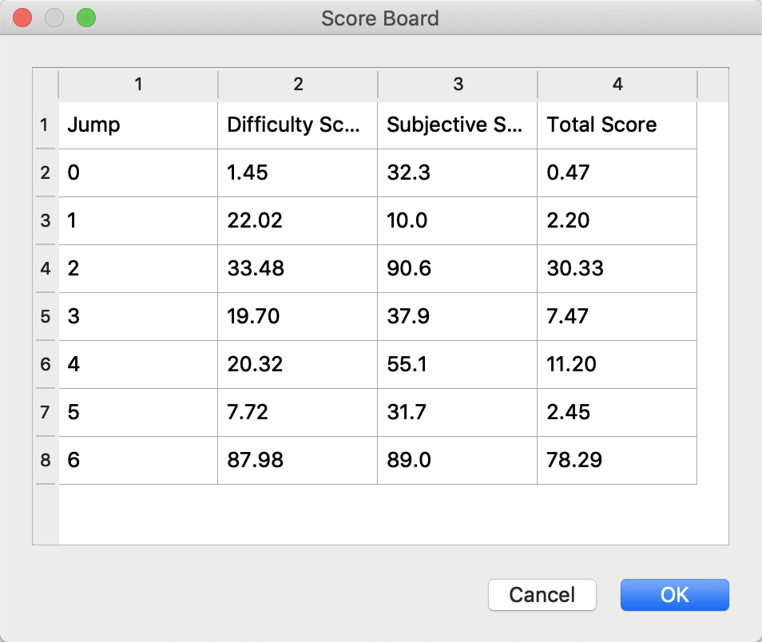
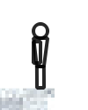
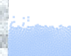

# OOP Team Project Document


## Team Members

| Name            | Student #  | Email                        |
| --------------- | ---------- | ---------------------------- |
| Arslane Boukrif | 2019403054 | arslane.boukrif@insa-lyon.fr |
| Fengshi Zheng   | 2016012177 | 962907278@qq.com             |
| Rachel Mao      | 2017080077 | rachelrmao99@hotmail.com     |


## Overview

This documentation is a brief introduction to our group's OOP team project. Our project targets at problem 2,  named *Plongeur*, the French word for "high dive"(高台跳水), which is a small computer game based on Qt and LiquidFun. In this documentation, firstly, a guidance to building, executing the project and how to play the game is given. Then, we demonstrate the main functions and features of our project briefly. Finally, the OOP design of the project's coral parts and a general description of our software design architecture is shown.


## Building & Executing Guidance

### Build Guidance

Since our project is developed on Qt platform on Mac, it is recommended that you configure and build our source code with Qt and also on Mac. If you build on other platforms as Win or Linux, make sure you built the LiquidFun library in accordance with your platform, and replace the attached LiquidFun library in our source folder.

Optimal build environment:

- MacOS Mojave 10.14.5
- Qt 5.10.0

When clicking on the "build" button in Qt creator, please also be sure that the `INCLUDE_PATH` and `LIBS` path of LiquidFun is located properly in your environment. (See `Plongeur.pro` for detail)

-----

### Executing Guidance & Software Functionalities

How to play *Plongeur*:

Plongeur is a simple high dive game based on Qt platform and LiquidFun physics simulation library. We got the idea of the game rule mainly from the example game quoted in the homework introduction pdf, where the player can control the jumping, rotating and other movements of the high diver to achieve an epic dive and high scores! To distinguish the player's skillfulness, we design an algorithm to evaluate the performance of the high dive, which will be discussed in detail later on.

On opening the app, you will see a main menu interface as below:



Three buttons are available in the main menu:

- Play: start the game and take off your first dive!
- Help: how to operate the diver.
- Quit: exit the game.

On clicking the "Play" button, you'll see a game frame as below:



Where a ~~naked~~ diver stands on a platform of 5m, above a pool full of water(we can ensure that the water is deep enough so that the diver won't get hurt after the jump)

To start diving, press `space` key three times and the diver will make a "fake" jump twice before finally making a "take-off" jump into the air. Below illustrates the "fake" jump of a diver(to emulate the real world diver)



After the diver jumps into the air and starts falling, the player can control the diver's motion via `A`, `S` and  `D` keys:

- `A`: rotate the diver counter-clock-wise.
- `D`: rotate the diver clock-wise.
- `S`: perform a random pose.

All motions above will be accounted for in the score evaluation, i.e., the more poses and larger rotation angle, the higher the difficulty scores(难度系数分数)



Finally, the diver shall hit the water due to gravity, and afterwards, all motion the diver do have no effect on the final score. For fun, we allow the player to even manipulate the diver to swim in the pool and create some funny balls via mouse right click(kind of a stinger 彩蛋). Then, the score of the diving will be listed on the top left of the frame:

- Difficulty Score: evaluated by number of poses and rounds of rotation.
- Subjective Score(percentage): evaluated by water splash on diver hitting the water.(will be discussed in detail later)
- Total Score: the final score, which equals to difficulty score * subjective score.



To reach a high subjective score, the player has to control the diver's torso to hit vertically into water so as to shrink water splash. Hence, a trade-off between the difficulty of the motion and the control of the body is the key to high total score, which makes *Plongeur* a fun and challengeable  game to play!

That's all for game rule and tips to high score. Hope you have a wonderful time playing!

-----

After each jump, you can click "Retry" for a new jump, and the scores of the previous jump will be recorded. On clicking "End" button at the right bottom of the game frame, the game frame window will disappear and a score board will show up:

 

This dialog displays the scores for each jump you've made in the game, so your diving legend will go on! However, the table contents will be erased once you quit the game.


## OOP and Software Architecture Design

### Gaming Architecture

*Plongeur* adopts a client-server gaming architecture for game fluency and software performance consideration, because the physics simulation provided by LiquidFun is computationally intensive and the updating of game frame is frequent.

The client here stands for the frontend and non-physical logic control of the game, they include those parts of the game frame:

- A graphics view for displaying the diver, the pool and the water… Implemented via GameScene class.
- A keyboard event filter, which detects press and release of "W, A, S, D, space" keys and calls respective Diver's functions to correspond.
- A mouse click event filter, which listens for mouse clicking at screen to create/lift stinger balls.
- Diving scores calculator, displayer and recorder, implemented distributively in different classes as GameFrame, Engine and ContactListener.

The server stands for the game backend specially designed for performing physical simulation. It is mainly the Engine class, which inherit QThread class to work in a different thread and encapsulates a `b2World` to perform the physical simulation of the world.

The architecture is called client-server because the 'client' is facing the player and frequently asks the 'server' for the simulation 'service' to get the physical result to make the game scene look real. 


### The GameFrame Class

The GameFrame is the central logic control device of the game, it not only incorporates a frame window to display the scene, but is also in charge of the GameScene along with all actors inside it (diver, water, pool…) and in charge of the game workflow. GameFrame inherits a QFrame class for displaying GUI.

Source File: `gameframe.cpp`

**Public Methods:**

- `setStart`: start / restart the game. This method recreates the world, initializes the pool and water, resets the diver's position & motion, and create connection with Engine class. It starts the physical engine to keep doing simulation in another thread, then.
- `setEnd`: end the game, this method quits the physical simulation, clears the scene, destructs the world and close the game frame window.
- `getScores`: get the history scores of the game. Getter for `m_scores`,  which is a vector of <double, double> pairs.

**Essential Private Methods:**

- `calculateScore`: when the engine detects the hit between diver and water and finished measuring the water splash, this method will be called, where the difficulty score and the subjective score will be computed and displayed as an animation. Details about how we calculate scores will be discussed in Algorithm part.

**Essential Protected Methods:**

- `keyPressEvent`: listening for key press event, if it's either 'W', 'A', 'S', 'D' or 'space', the corresponding method of Diver will be called.(if it's 'W', 'A' or 'D', it will start a timer to keep calling rotation/swimming method until key release)
- `keyReleaseEvent`: listening for key release event, stops the timer if necessary.


### The GameScene Class

GameScene is a derived class of QGraphicsScene, which is a very convenient and highly efficient class for assembling and rendering graphics items in Qt.

GameScene aggregates a b2World, a Pool, a Diver and a Water class, and maintains their creations and destructions. Most important of all, the GameScene owns a proxy engine, which is responsible for doing all the LiquidFun simulation jobs, and the scene is always advanced with the physics situation computed by Engine.

Source File: `gamescene.cpp`

**Essential Public Methods:**

- `clear`: clear the scene, delete b2world and creates a new one, delete the engine and creates a new one.
- `createPool`: create an empty pool at default position.
- `createDiver`: create the diver at designated position.
- `createWater`: create "a b2Shape of" water at designated position.
- `asyncSimulate`: tells the Engine to start a parallel simulation.
- `syncSimulate`: tells the Engine to simulate in the same thread as the main thread. This method was only used in dev time.


### The Engine Class

Source: `engine.cpp`

As mentioned above, the Engine works in another thread to perform the intense computation, so the simulation must be done asynchronously. Therefore, we think of a way to overcome the asynchrony between Engine and GameScene - by using the Qt's *signal-slot* mechanism to connect the Engine's `stepped` signal emitted after every simulation frame to the GameScene's `advance` slot.(a queued connection is needed for multithread communication)

```cpp
connect(m_engine, SIGNAL(stepped()), this, SLOT(advance()), Qt::QueuedConnection);
```

So after each frame of simulation, the scene is immediately updated to synchronize with Engine, thus, being able to display a consecutive and fluent game frame to the player.

Besides, the Engine contains a **ContactListener** class, implementing b2ContactListener, which is used for detecting contact between diver and pool, contact between diver and water. The former kind of contact helps determine the state of diver(whether in air or touched pool), the later one helps determine the state and also helps measure the water splash.


### The Actor Class

Above is about how we organize the game and integrate each concrete class in a systematic way. Now we move on to how we design each graphics object, starting with the Actor class.

Source: `actor.cpp`

Actor is the base class of diver and pool. Each of the later two consists of LiquidFun rigid bodies, and needs to be painted in certain figure & color, that's why we decided to design a base class - Actor - to take over the b2Body and painting job of a LiquidFun rigid body. Straightforwardly, we derive from QGraphicsObject to get the Actor class. We let it contain a b2Body pointer to store its physical fixture and properties. 

Firstly, an actor knows its LiquidFun physical coordinates and angle, but to paint it, we still need to convert the LiquidFun vector and scalar to QGraphicsScene. So a global function called `scaleFromB2`, `scaleToB2` and `mapFromB2`, `mapToB2` is defined to map scalar and vector from and to LiquidFun. Also, for code reusability, we implemented several global helper functions `getPolygonFromB2`, `getBoundingRectFromB2` and `drawB2Fixtures` to assist in paint and boundingRect methods of Actor.

Secondly, to paint a rigid body at different positions with different angles is a tough and tedious thing to do. Fortunately, though, Qt has provided us with a very useful and efficient way to paint objects in any possible transform. i.e., we only have to define how we should paint each object in their "first place", and when they are moving or rotating later on, we can simply synchronize the object's scene position and scene angle with its LiquidFun position and angle via `setPos` and `setRotation` method of QGraphicsItem class, after calling which Qt will determine where and what angle to paint the object for us. To implement this idea, we just have to override `paint`,  `advance`, and `boundingRect` method.

- `paint`: how to exactly draw the fixture of the body. For debugging usage, a default debug draw of the fixture is implemented in Actor. Below is an example of debug draw:

  

- `boundingRect`: a rectangle that bounds the graphics object. Qt takes advantage of this property to accelerate graphics rendering.

- `advance`: when the scene's `advance` method is called, the `advance` method of any object in the scene is activated. So we can synchronize the pos and angle of b2Body with the Actor here:

  ```cpp
  QGraphicsItem::setPos(mapFromB2(m_body->GetPosition()));
  QGraphicsItem::setRotation(qRadiansToDegrees(m_body->GetAngle()));
  ```


### The Pool Class

**Overview :**

The pool object is composed of the tank, the platform and the structure which links those two. The diver will jump from the platform and reach the tank filled with water. 

**Header file :**

The pool is an actor of the game so the class is inherited from the Actor one.

Variables :

- QPixmap s_texture : for the texture
- QRectF m_bbox : to set the physical borders of the actor (according to the scale)

Methods :

- Constructor
- Paint : to render the pool
- BoudingRect : to return the physical borders of the actor

**Source file :**

Constructor :

The pool constructor use the b2Body object passed in the GameScene class and set its type as static (the pool shouldn’t move).

To create the different part of the pool (tank, platform and structure) we use a b2PolygonShape vector and create 4 rectangles with the same fixture definition. The m_bbox variable is a QRectF object using the scale converter to set the physical borders.

Paint :

The paint method uses a QPainter object to render the pool according to the passed texture and draw it using the drawB2Fixtures method from the mother class (for the polygon shape case).

BoundingRect :

Return the QRectF m_bbox variable to compute contacts according to the scale. 


### The Diver Class

**Overview:**

The diver is the main subject of this high diving game. Upon certain keyboard controls, the diver can jump, rotate and pose in midair, and eventually swim in the swimming pool. The implementation of the Diver consists of creating the Diver as a Box2D compound shape, writing its paint methods, and finally applying keyboard controls.

**DiverParts**

Each part of the diver­­–DiverHead, DiverArm, DiverLeg, and DiverTorso–is a subclass of DiverPart. The diver is initialized in gamescene, where a QVector of empty bodies are passed into the Diver constructor, which then constructs each of the DiverParts of the diver in the initialization list. Each DiverPart subclass has its unique boundingRect() and paint() function. The boundingRect functions are used to encompass the area and coordinates of each object, and the paint functions are responsible for realizing the graphics aspect of each objects. Each DiverPart body’s shape and position are modified to fit a human figure: the head is a circle shape placed above the torso, and the torso, arms, and legs, are rectangles that positioned to create an android figure. The arms and legs are attached to the torso using a revolute joint, and the head is attached to the torso with a distance joint.

**Player Controls** 

In gameframe.cpp are methods keyPressEvent and keyReleaseEvent, which manage the actions resulted from keyboard events. Upon pressing W, A, S, D, or space, functions jump, turnLeft, turnRight, pose, and swim may be called. 

To let the diver jump, the jump() method would allow for the diver to jump two times and then dive off the platform on the third jump. The diver is only able to jump if he is on the platform. This is implemented by a Boolean statement that checks whether or not the current state is the on-platform state (the state machine can be found in the actor class). Lastly, the jumping effect is a simple setLinearVelocity function. 

To make the diver spin in midair, there are also methods in Diver, turnLeft() and turnRight(), which would apply torque on the diver’s torso. However, spinning differs from jumping in that the diver would jump only once regardless of how long you press the key: the diver will spin only as long as you hold down the key. To combat this issue, we do the following. In gameframe there is `std::function<void()> m_keep_doing`, which by default is set to nullptr. After a spin key event, `m_keep_doing` is set to the corresponding diver function–turnLeft or turnRight–and the QTimer starts. QTimer stops upon keyReleaseEvent. To realize the spinning motion, or other actions defined by `m_keep_doing`, we use the line

```cpp
connect(&m_timer, &QTimer::timeout, this, [this](){ m_keep_doing(); });
```

which essentially runs the `m_keep_doing` function up until the timer times out. In short, the m_keep_doing action will sustain as long as the key that triggers the action is sustained.


### The Water Class

Source: `water.cpp`

Surprisingly, unlike diver and pool, water is a different concept in Plongeur, since LiquidFun chooses to describe and handle the behavior of particles via b2ParticleSystem class, rather than some independent b2Bodies. Concerning this fact, we have to implement a different taste of graphics object class to hold water - we derive directly from QGraphicsObject to get Water class.

The essence of water is actually an array of massive particles, so discovering an efficient way to draw them is of critical importance. Noticing that LiquidFun describes and stores the particles simply by storing their positions and velocities in an array, with an index indicating which particle it is, we can make use of this position array(or buffer in a more precise term) draw them efficiently.

The key is to call `QPainter::drawPoints` method, which can draw an array of points really fast. Though it seems inappropriate to view water particles as points, we found out that if we set the QPen's thickness, color and style appropriately, the water already looks fairly real.




### Design of The Scoring Algorithm

It is never too much to ponder the algorithm for computing convincing and reasonable diving scores. We finally decided to split the scoring into two parts: the difficulty score and the subjective score. The final result is the multiplication of these two.

One would think intuitively that the difficulty score should reflect a diver's skillfulness, so in our circumstance, the number of rounds the diver has rotated and number of poses the diver has done are accounted for computing the score. The formula of difficulty score is:
$$
\text{diff. score} = 30 \times \# rounds + 10 \times \# poses
$$
As for subjective score, we believe it would be reasonable to evaluate the diving quality according to the water splash the diver makes when hitting the water. The score is calculated by measuring the average approaching velocity between diver's torso and water particles that contact with diver in the first few seconds right after any water drop touches diver's body. The splash between each water particle and the diver body is computed following below equation:
$$
\text{splash} = (\bold{v_b} - \bold{v_p}) \cdot \bold{n} \cdot w
$$
Where $v_b$ stands for velocity of the diver's torso, $v_p$ stands for velocity of this particle, $n$ stands for the normal vector of diver's torso and $w$ denotes the the contact weight(the greater w, the larger overlap of the contact). In light this formula, only the relative velocity that is perpendicular to the body contributes to the average splash. Likewise, a lot of such splash value is obtained and averaged to get the final splash value.

After computing the splash value, we interpolate it to get the subjective score(percentage). The interpolation is a quadratic polynomial, which maps 0.5 to 100%, 1.0 to 80% and 2.0 to 10%, given as follows:
$$
\text{subj. score} = 1.1 - 0.1*\text{splash} - 0.2*\text{splash}^2
$$
Finally, we multiply difficulty score and subjective score to get the total score which measures the diver's performance adequately:
$$
\text{total score} = \text{difficulty score} \times \text{subjective score}
$$


## Reference

- [LiquidFun Official Programmer's Guide](https://google.github.io/liquidfun/Programmers-Guide/html/index.html)
- 郑逢时，OOP个人大作业文档

